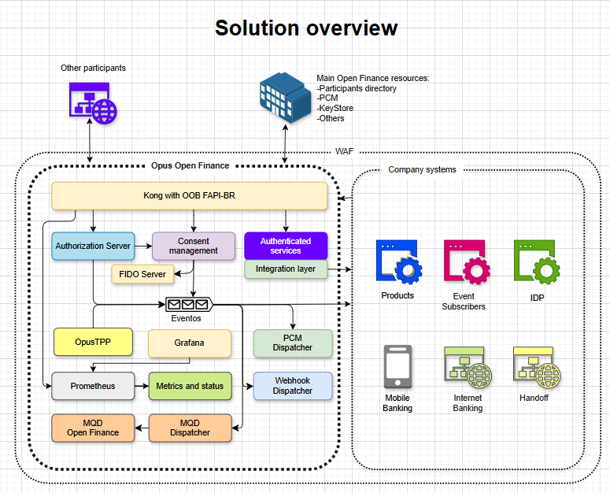
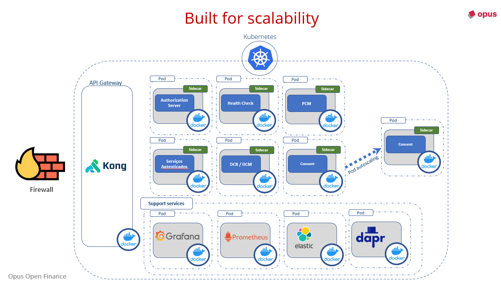

# Architecture Overview

The solution architecture is based on **microservices**, designed to support automatic horizontal scalability, and implemented in **Docker** containers running in a Kubernetes cluster environment.

The platform is offered in three modes:

- In the client's cloud, with the environment managed by the client's team;
- In the client's cloud, as a subaccount, with the environment managed by the Opus Software team;
- In a Software as a Service (SaaS) model.

The solution has been successfully used by clients in the following environments:

- **Kubernetes environments as managed services**:
  - Google GKE
  - AWS AKS
  - Azure EKS
- **On-premise Kubernetes clusters manually managed**

---

## Components and Tools

For execution, the platform requires the following components:

- **PostgreSQL database** (typically used as a managed service)
- **Message Queue**
  - Different message queue mechanisms have been used by our clients, including SQS/SNS, GCP Pub/Sub, and Kafka;
  - The platform uses an abstraction component that supports the major message queue mechanisms in the market.
- **Distributed Log Management System**
  - The standard solution packaged with the platform is **Grafana Loki**, but other solutions have been successfully used by our clients, such as **Datadog** and **Elastic Stack**;

  The platform also embeds an **API Gateway** that is packaged along with the product and can function behind the client's standard product, if necessary.

  The solution also requires a **Web Application Firewall (WAF)** provided by the client, which must support the **Mutual TLS (mTLS)** protocol.

  Finally, in environments managed by the Opus team, we use the **Prometheus/Grafana** combination for visibility and monitoring of the running solution. Other solutions like **Dynatrace** have been successfully used by our clients.

---

## Horizontal Scalability

The microservices-based architecture adopted by the solution, running in containers managed by Kubernetes, is ideal for handling the variable demand of the *Open Finance Brasil* ecosystem because it allows efficient horizontal scalability. Each microservice can be scaled independently, ensuring that only the necessary components receive more resources during high demand periods. Kubernetes facilitates this process by automatically monitoring resource usage and scaling execution instances as needed, maintaining system availability and performance without wasting resources.

## Infrastructure and Configuration

- **Autoscaling Configuration**:
  - All system modules support autoscaling, allowing Kubernetes to adjust the number of instances based on CPU and memory usage.

- **Distribution and Management**:
  - Uses **Helm charts** for:
    - Definition
    - Installation
    - Application upgrades
    - Resource selection for execution in the cluster

- **Terraform Scripts**:
  - Provided for the installation and configuration of infrastructure components.
