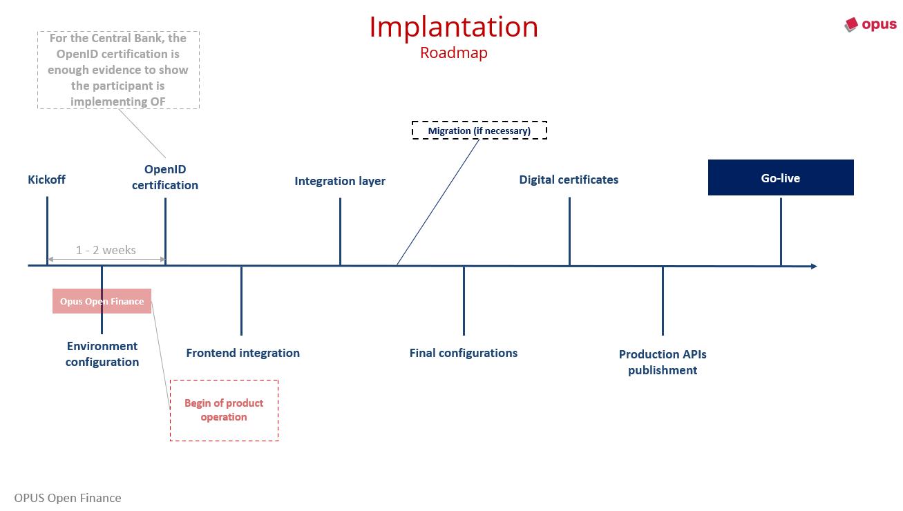

## Introduction

The deployment process for the **Opus Open Finance Platform** follows a well-defined sequence of steps, ranging from the proper configuration of the necessary execution environments to the actual production launch. The Opus team oversees all deployment steps, which are presented below, ensuring the success of each stage.

During deployment, an **Opus Delivery Manager** is assigned to manage the end-to-end process, maintaining continuous contact with the client. After deployment, Opus and the client will define the focal points for the day-to-day relationship, both for monitoring operations and ensuring compliance with regulatory SLAs, as well as evaluating and implementing new regulatory requirements.

It is important to highlight that the most labor-intensive stages of the deployment process are those related to integrating the **Opus Open Finance Platform** with the back-end systems and customer service channels (mobile app and Web Internet Banking) of the financial institution. These stages require the development of new software artifacts and the adaptation of customer service applications. The documentation includes specific sections that detail the necessary integration steps for each profile of the financial institution's participation in *Open Finance Brasil*.

---

## Deployment Roadmap

### 1. **Kickoff**

- Presentation of the project plan with detailed activities and schedule.
- Definition of the team required for each step of the process.
- Introduction to the deployment team.

---

### 2. **Environment Setup**

- Provisioning of environments:
  - Development
  - Staging
  - Production
- Configuration of the **Opus Open Finance Platform** in the environments.
- Configuration of the *sandbox* for the Open Finance Brasil participant directory, which is the secure testing environment for the ecosystem aimed at integration testing.

---

### 3. **OpenID Certification**

- Execution of tests for validation of the staging environment.
- Preparation of evidence for submission to OpenID ([RP and OP certifications](../../Open-Finance-Brasil/OFB-Certificações.html)).
- Payment of the certification fee.
- Publication of the institution on the [official OpenID website][Site-OpenID].

---

### 4. **Screen Integration**

- Development of the [consent journey screens](../../Open-Finance-Brasil/JornadaConsentimento/OFB-JornadaConsentimento.html):
  - For web, app, and handoff (if necessary).
  - According to the <a href=https://openfinancebrasil.atlassian.net/wiki/spaces/OF/pages/17378535/Guia+de+Experi+ncia+do+Usu+rio target=_blank>Open Finance Brasil user experience guide</a>.
- Execution of tests for the consent journey.
- Full integration of the journey in the institution’s channels.

---

### 5. **Integration Layer**

- Integration of the institution’s back-end systems with the product, according to the [financial institution’s participation profile](../../Open-Finance-Brasil/PerfisOFB/OFB-Perfis.html). Typically, [this involves building the *integration layer*](../Integração/OOF-Integração.html) adapted to the institution’s back-end systems.
- **Note:** Usually, it is not necessary to adapt the back-end systems themselves, but to map how information is extracted for each financial product offered by the institution (in the case of the data transmitter profile), or how to process payments and check the results of these operations (in the case of the account holder profile). The integration layer acts as an adapter between the internal formats of the back-end systems and those required by *Open Finance Brasil*.

---

### 6. **Migration**

- Migration of consents and DCRs to the new product database.
- Necessary only for institutions already participating in Open Finance with another solution or proprietary technology.

---

### 7. **Final Configurations**

- Full journey testing with the integration layer and screens ready.
- Execution of functional tests.
- Configuration of the production participant directory.

---

### 8. **Digital Certificates**

- Acquisition of [digital certificates](../../Open-Finance-Brasil/OFB-Certificações.html).
- Registration of certificates in the directory.

---

### 9. **Go-Live**

- Start of solution monitoring.
- Submission of regulatory reports.

[Site-OpenID]: https://openid.net/certification/#FAPI_OPs
