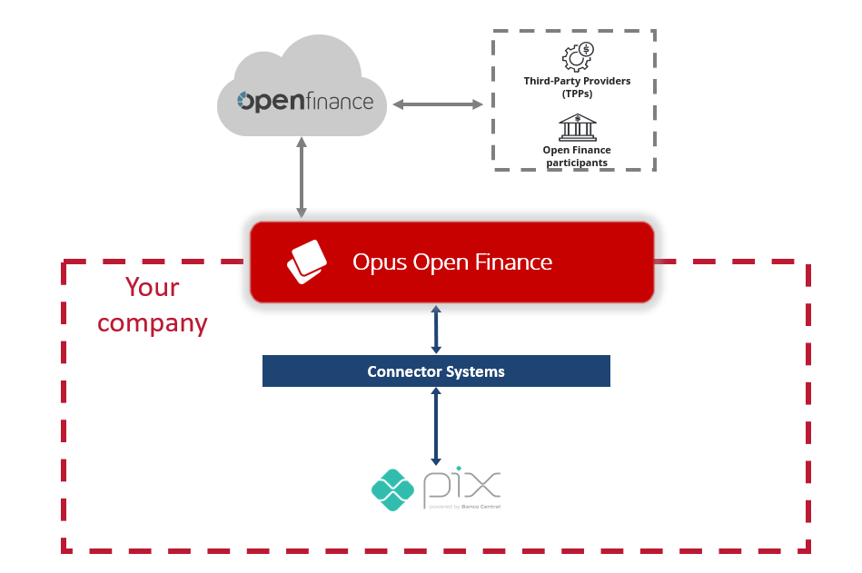

## Payments

Integration with the payments pillar of _Open Finance Brasil_ is only required for the Account Holder profile. This integration allows the Opus product to direct a request to the necessary back-end systems for the payment flow. The payment flow, at a high level, is divided into two parts: **consent** and **payment settlement**, and both require their necessary integrations. The integration with the product works through a layer we call _connectors_.

## Integration

The image below outlines how the connector works. When a participating institution of _Open Finance Brasil_ sends a payment request, the **Opus Open Finance Platform** receives it and performs all necessary validations, including verifying the consent associated with the payment. Once the request is considered valid, the platform will call the connector to effect the payment (in the example, triggering the institution’s Pix service).

---

## Connector Layer

Typically, a Connector is a route defined in [Apache Camel](xxx) that connects a financial institution’s back-end system endpoint to the platform, performing the payment associated with the received request.

Additionally, connectors can make small transformations to the data passed to comply with the formats of both the Opus platform and the activated back-end system. Finally, connectors can make necessary changes by omitting or adding fields in requests and responses to ensure both sides of the communication are aligned.

For payments, there are currently routes to: create payment initiation (POST) after consent is granted, retrieve previously made payment initiations (GET), cancel payment initiation (PATCH), discover and list accounts, and validate payments.

It is important to note that the platform will only initiate the payment; the institution is responsible for actually processing or scheduling the payment and returning the result to the Opus product.

## Connector Routes

Below is a brief explanation of each payment integration route. As the product follows the specifications of _Open Finance Brasil_ in all phases, if any doubts arise, the final word will always be from the official regulatory documentation. Specifically for payment initiation requests, refer to the [Payments V4 documentation](https://openfinancebrasil.atlassian.net/wiki/spaces/OF/pages/347079010/Informa+es+T+cnicas+-+SV+Pagamentos+-+v4.0.0) and [Automatic Payments V1 documentation](https://openfinancebrasil.atlassian.net/wiki/spaces/OF/pages/345178397/Informa+es+T+cnicas+-+SV+Pagamentos+Autom+ticos+-+v2.0.0).

### Make a Payment

The `POST pix payment` route is the payment initiation route for a Pix payment. It is important to note that, in Open Finance, the only accepted payment method is Pix. This connector is activated during the payment journey itself, i.e., after the consent has been authorized.

The schemas can be found here:

|Schema                             | Link        |
|-----------------------------------|:-----------:|
|Request example  |[link](./Schemas_conector_pgto/payment/paymentsPostPixPayments_v3/request-example.json)|
|Recurring payments request V2  |[link](./Schemas_conector_pgto/payment/paymentsPostPixPayments_v3/request-recurring-example-v2.json)|
|Request schema  |[link](./Schemas_conector_pgto/payment/paymentsPostPixPayments_v3/request-schema.json)|
|Response error example  |[link](./Schemas_conector_pgto/payment/paymentsPostPixPayments_v3/response-error-example.json)|
|Response error schema  |[link](./Schemas_conector_pgto/payment/paymentsPostPixPayments_v3/response-error-schema.json)|
|Response example  |[link](./Schemas_conector_pgto/payment/paymentsPostPixPayments_v3/response-example.json)|
|Recurring payment response example  |[link](./Schemas_conector_pgto/payment/paymentsPostPixPayments_v3/response-recurring-example.json)|
|Response schema  |[link](./Schemas_conector_pgto/payment/paymentsPostPixPayments_v3/response-schema.json)|

### Cancel a Scheduled Payment

The `PATCH pix payment` route cancels a scheduled Pix payment. According to regulations, Open Finance participants must have their scheduled Pix systems in production. This connector will be called only if the customer uses the consent management area to cancel a scheduled payment, i.e., the consent must have already been authorized, and the payment scheduled.

The schemas can be found here:

|Schema                             | Link        |
|-----------------------------------|:-----------:|
|Request example  |[link](./Schemas_conector_pgto/payment/paymentsPatchPixPaymentsPaymentId_v3/request-example.json)|
|Recurring payments request V2  |[link](./Schemas_conector_pgto/payment/paymentsPatchPixPaymentsPaymentId_v3/request-recurring-example-v2.json)|
|Request schema  |[link](./Schemas_conector_pgto/payment/paymentsPatchPixPaymentsPaymentId_v3/request-schema.json)|
|Response error example  |[link](./Schemas_conector_pgto/payment/paymentsPatchPixPaymentsPaymentId_v3/response-error-example.json)|
|Response error schema  |[link](./Schemas_conector_pgto/payment/paymentsPatchPixPaymentsPaymentId_v3/response-error-schema.json)|
|Response example  |[link](./Schemas_conector_pgto/payment/paymentsPatchPixPaymentsPaymentId_v3/response-example.json)|
|Recurring payment response example  |[link](./Schemas_conector_pgto/payment/paymentsPatchPixPaymentsPaymentId_v3/response-recurring-example.json)|
|Response schema  |[link](./Schemas_conector_pgto/payment/paymentsPatchPixPaymentsPaymentId_v3/response-schema.json)|

### Validate a Payment

The `GET validate payment data` route performs a series of validations during the account holder’s consent step, so that if any errors are found, the consent will not be initiated. This connector is part of a regulatory step and defines several validations, such as:

- The payment amount must not exceed the transactional limit (typically 999999999.99);
If it has a static QR Code:
- The payment’s localInstrument field must be QRES;
- The payment amount must match the QR Code amount;
- The proxy in the payment must match the proxy in the QR Code;
If the QR Code is dynamic:
- The payment’s localInstrument field must be QRDN;
- The QR Code must not have been used yet;

The schemas can be found here:

|Schema                             | Link        |
|-----------------------------------|:-----------:|
|Request example  |[link](./Schemas_conector_pgto/consent/validatePaymentData/request-example.json)|
|Request schema  |[link](./Schemas_conector_pgto/consent/validatePaymentData/request-schema.json)|
|Recurring payment request V2  |[link](./Schemas_conector_pgto/consent/validatePaymentData/request-recurring-example-v2.json)|
|Response error example  |[link](./Schemas_conector_pgto/consent/validatePaymentData/response-error-example.json)|
|Response error schema  |[link](./Schemas_conector_pgto/consent/validatePaymentData/response-error-schema.json)|
|Response example  |[link](./Schemas_conector_pgto/consent/validatePaymentData/response-example.json)|
|Response schema  |[link](./Schemas_conector_pgto/consent/validatePaymentData/response-schema.json)|

### Retrieve Account Information

The `GET discovery` route retrieves the account information of the account holder making the payment initiation. This happens during the consent step, where the account holder has the option to change the account at the institution where the payment amount will be debited from.

The schemas can be found here:

|Schema                             | Link        |
|-----------------------------------|:-----------:|
|Request example  |[link](./Schemas_conector_pgto/consent/discoverPayments_v2/request-example-pix.json)|
|Recurring payments request V2  |[link](./Schemas_conector_pgto/consent/discoverPayments_v2/request-example-recurring-pix-v2.json)|
|Request schema  |[link](./Schemas_conector_pgto/consent/discoverPayments_v2/request-schema.json)|
|Response example  |[link](./Schemas_conector_pgto/consent/discoverPayments_v2/response-example.json)|
|Response schema  |[link](./Schemas_conector_pgto/consent/discoverPayments_v2/response-schema.json)|

### Retrieve Payment Status

According to regulations, a `GET pix payment` route must be implemented to return the status of a Pix payment. This call will naturally be made only after a payment has been processed.

The schemas can be found here:

|Schema                             | Link        |
|-----------------------------------|:-----------:|
|Request example  |[link](./Schemas_conector_pgto/payment/paymentsGetPixPaymentsPaymentId_v3/request-example.json)|
|Recurring payments request V2  |[link](./Schemas_conector_pgto/payment/paymentsGetPixPaymentsPaymentId_v3/request-recurring-example-v2.json)|
|Request schema  |[link](./Schemas_conector_pgto/payment/paymentsGetPixPaymentsPaymentId_v3/request-schema.json)|
|Response example  |[link](./Schemas_conector_pgto/payment/paymentsGetPixPaymentsPaymentId_v3/response-example.json)|
|Recurring payment response example  |[link](./Schemas_conector_pgto/payment/paymentsGetPixPaymentsPaymentId_v3/response-recurring-example.json)|
|Response schema  |[link](./Schemas_conector_pgto/payment/paymentsGetPixPaymentsPaymentId_v3/response-schema.json)|
