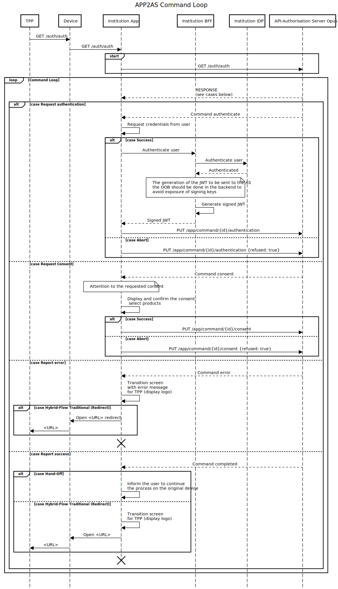

# Mobile App

The mobile app integration for generating consent provides the best user experience for the institution's client, as it allows the consent journey and consent management to be performed in a fluid and natural way.

In the context of *Open Finance Brazil*, the mobile app is triggered when the client is about to grant consent. Typically, the client has initiated the action of sharing their data with another financial institution, and it will be necessary to execute an authorization flow where the mobile app of the other institution calls the mobile app of the transmitting financial institution (i.e., *our* mobile app) to authenticate the consent.

Similarly, when the client authorizes a *payment transaction initiator* to send a payment request to the account-holding financial institution, a consent journey will be triggered that will activate the mobile app to authenticate and confirm the transaction.

## Deep Link and Universal Link

The institution's app needs to intercept calls from the data receiver (who is requesting the creation of data sharing consent) or the payment transaction initiator and send them to the Authorization Server when they occur on the user's mobile device, allowing consent generation within the app.

The app can also be triggered during a *hybrid flow* with *Handoff*, where the user is creating the consent on a computer via the Web, and the institution only provides authentication through its mobile app. In this scenario, the **Opus Open Finance** Authorization Server (AS) will display a QR code with a URL that should also be intercepted by the app. Using an interceptable URL allows the user to scan the QR code using any app, not just the institution's app.

Thus, we have two URL standards that need to be intercepted by the institution's app, as shown in the table below:

| Source                     | URL                                                     |
| ---------------------------| ------------------------------------------------------- |
| Same device                | `https://<EV-FQDN-open-banking>/auth/auth`              |
| Another device (*HandOff*) | `https://<EV-FQDN-open-banking>/auth/handoff/{id}`      |

### What to do when intercepting a URL?

Once the application is intercepting the URLs and being triggered during a consent request, the next step is to process the actual consent generation.

After obtaining an intercepted URL, the first step is to perform a `GET` request on the triggered URL, including all query-string parameters that may exist and adding the `Accept` header with the value `application/json`. This header informs the Authorization Server that the request is being made by the app and not by the browser.

Knowing that the request was made by the app, the Authorization Server will function as a REST API, responding to requests always in JSON format. Adding the header is mandatory in all calls between the institution's app and the Opus Open Finance Authorization Server.

The response from the initial `GET` is the first of a series of commands the app must execute during an event loop coming from the Authorization Server. The definition of this event loop will be detailed when starting the integration project of the mobile app with the Opus platform.

## Sequence Diagram

The following sequence diagram summarizes the interaction between the institution's mobile app and the Authorization Server.

## Open API Specification

The definitions of the REST API provided by the Authorization Server for the mobile app can be found [here][API-Mobile]

## Mock for Integration

To assist in the development of the integration, a *mock* is available in the [Mockoon](https://mockoon.com/) tool and is defined in this [JSON file](./mockoon.json).

Several scenarios are mocked and triggered through the respective initial URLs:

| Scenario                                                                   | URL to start the process                               |
| -------------------------------------------------------------------------- | ------------------------------------------------------ |
| Hybrid-flow / Payment                                                      | <http://localhost:3301/auth/auth?id=standard>           |
| Hybrid-flow hand-off / Payment                                             | <http://localhost:3301/auth/app/commands/handoff>       |
| Hybrid-flow / CPF_MISMATCH during authentication                           | <http://localhost:3301/auth/auth?id=cpf>                |
| Hybrid-flow / EXPIRED_CONSENT in the initial link                          | <http://localhost:3301/auth/auth?id=expired>            |
| Hybrid-flow / RESOURCE_MUST_CONTAIN_ID on confirmation                     | <http://localhost:3301/auth/auth?id=resource>           |
| Hybrid-flow / RESOURCE_MUST_CONTAIN_ID_SELECTABLE_PRODUCTS on confirmation | <http://localhost:3301/auth/auth?id=resource>           |
| Hybrid-flow / DISCOVERY_ERROR during authentication                        | <http://localhost:3301/auth/auth?id=discovery>          |
| Hybrid-flow / DISCOVERY_TIMEOUT during authentication                      | <http://localhost:3301/auth/auth?id=discovery-timeout>  |
| Hybrid-flow / INVALID_STATUS_CONFIRMATION on confirmation                  | <http://localhost:3301/auth/auth?id=resource>           |
| Hybrid-flow / GENERIC_ERROR in the initial link                            | <http://localhost:3301/auth/auth?id=generic>            |

To run the mock, simply import the JSON into the *Mockoon* tool and start the "Opus Open Finance Authorization Server Apps API" environment server.

[API-Mobile]: ../../../../../../../swagger-ui/index.html?api=Mobile
