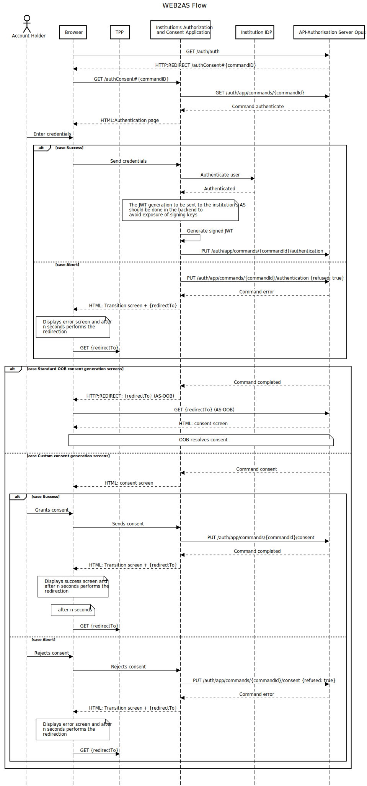

# Internet Banking

If the institution requires it, it can authenticate its customers through its own login page on *Internet Banking*. Once the login is completed, the institution can choose to use the standard consent generation screens provided by Opus Open Banking or use its own custom screens.

## Starting the Custom Web Login Flow

The flow starts with the first `GET` request to the authentication URL at the Authorization Server of the **Opus Open Finance Platform**. The URL follows this pattern: (`https://<EV-FQDN-open-banking>/auth/auth`).

After receiving this `GET`, the Authorization Server redirects the user’s browser to the institution's system responsible for authentication. This URL is configurable within the Authorization Server.

This configuration defines the *template* for the institution’s custom authentication URL. Therefore, the initial identifier of the authentication flow that will be handled by the login page can be merged into the URL in any way the institution desires.

The merge allows the institution to receive the identifier through the `query-string`, `fragment`, or `url`, as shown in the table below:

| Format       | Example URL                                           |
| ------------ | ----------------------------------------------------- |
| Query string | `https://ev.instituicao.com.br?codigo=<IDENTIFIER>`   |
| Fragment     | `https://ev.instituicao.com.br#<IDENTIFIER>`          |
| URL          | `https://ev.instituicao.com.br/<IDENTIFIER>`          |

The example provided in the documentation uses the **Fragment** format, which is the most recommended of the existing options. This format also removes the identifier from the navigation history, avoiding any confusion on the client’s part (e.g., when attempting to use an old consent URL).

If this configuration is defined, the Authorization Server will understand that this is a custom web authentication flow and will return to the institution's authorization application a redirection URL containing the `command` identifier created for the start of the flow.

Communication between the institution's web application and the Authorization Server will happen through `commands` within an event loop. The definition of this event loop will be detailed when starting the integration project of the mobile application with the Opus platform.

## Using the Custom Consent Generation Flow

The institution can choose between using the standard consent generation screens provided by Opus Open Finance or opting to use its own custom consent generation screens.

There is a setting in the Authorization Server that allows defining the institution’s choice.

If the institution chooses to use its own consent generation screens, the part of the flow related to selecting resources and approving/denying consent, as well as the final screen responsible for transitioning the consent generation back to the financial institution that made the request, will be handled by the institution itself. It must communicate via API with the Authorization Server to inform the selected resources and the approval/denial of the consent in question.

## Open API Specification

The definitions of the REST API provided by the Authorization Server can be consulted [here][API-Mobile].

## Sequence Diagram

The following sequence diagram illustrates the interaction between the institution's web application and the Authorization Server, covering the authentication step followed by the consent generation flow, both for the use of standard screens and custom screens.

[API-Mobile]: ../../../../../../../swagger-ui/index.html?api=en-Mobile
